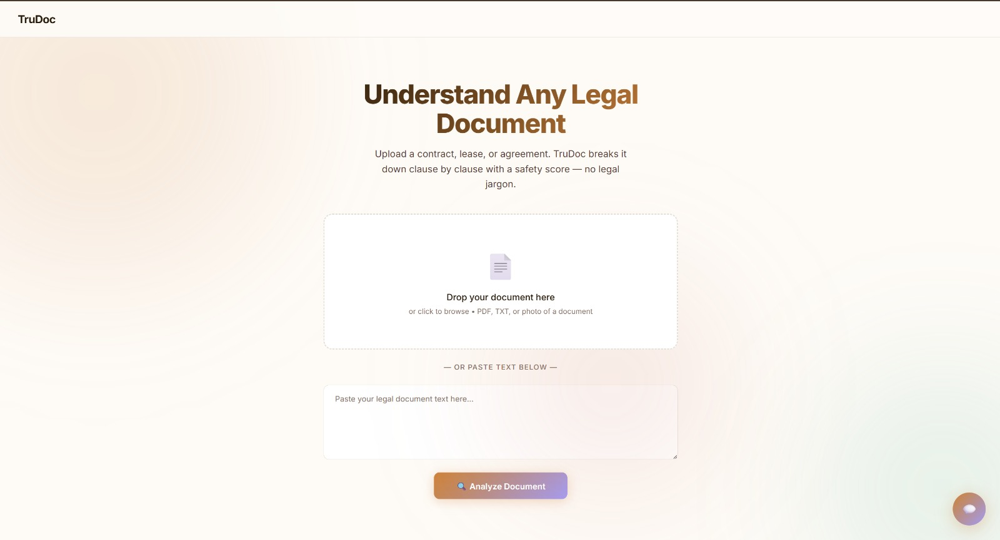
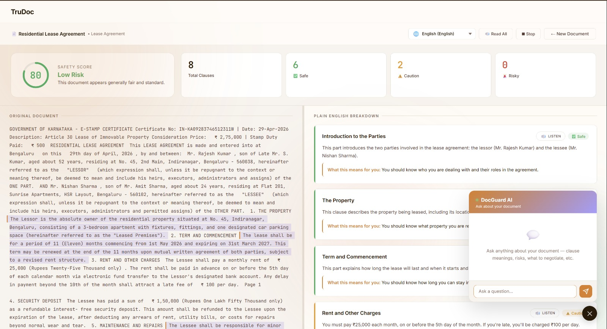

#  TruDoc – AI Legal Document Analyzer

> Understand any contract — no law degree needed.

---

##  Live Demo
https://trudoc.netlify.app/

---

## Screenshots





---

## Overview

TruDoc is an AI-powered tool that helps users understand legal documents easily. It converts complex legal language into simple explanations, detects risks, and highlights important clauses.

---

## Problem

Most people sign legal documents without understanding them due to complex language, hidden clauses, and lack of affordable legal help.

---

## Solution

- Safety score (0–100)
- Clause-by-clause explanation
- Risk detection (Safe / Caution / Risky)
- Missing clause identification
- AI chat for follow-up questions
- Supports PDF, text, and images

---

##  How It Works

1. Upload document  
2. AI processes content  
3. Clauses are analyzed  
4. Results with score and explanation are shown  

---

##  Tech Stack

- HTML, CSS, JavaScript (Vite)
- Groq LLM API
- PDF.js
- OCR support

---
## 📁 Project Structure

```bash
Legal/
├── public/
├── src/
│   ├── assets/
│   ├── counter.js
│   ├── groq.js
│   ├── pdf.js
│   ├── main.js
│   └── style.css
├── index.html
├── .env
├── package.json
└── .gitignore
```
##  Features

- Instant AI analysis  
- Plain language explanations  
- Risk highlighting  
- Chat assistant  

---

##  Installation

```bash
git clone https://github.com/your-username/trudoc.git
cd trudoc
npm install
npm run dev
